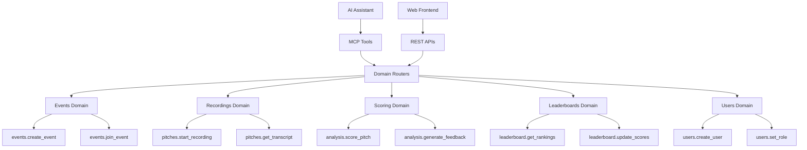
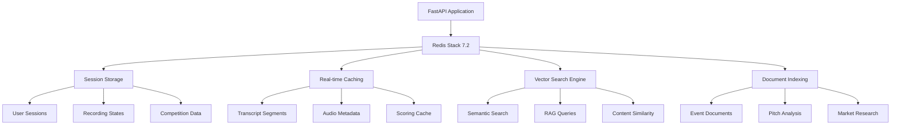

# Building with MCP + Redis Stack: Lessons from the AI Agents Hackathon

*Technical learnings from PitchScoop: An MCP-first pitch competition*

## The Challenge
One day at the [MCP - AI Agents Hackathon](https://juniper-giant-a3f.notion.site/MCP-AI-Agents-Hackathon-Sep-19-11c9fb250b4b80c488b7e2d7b6d6816d) in San Francisco (Sep 19). 
**Goal: Explore MCP for AI integration and try Redis Stack for rapid development.**

```sidebyside

We built **PitchScoop**, a pitch competition platform powered by MCP where AI agents manage events, score presentations, and update leaderboards. 

From the start, we challenged ourselves to run every part of the app through MCP. The hackathon ran from 9:30 AM to 4:30 PM, giving us about seven hours of focused development time.

PitchScoop went on to win **first place** as well as **Best Use Case of Redis**. Here’s what we learned about combining MCP with Redis Stack for rapid prototyping.
---

```

```highlight
## What is MCP? 
**Model Context Protocol (MCP)** is a standard that allows AI agents to call your application's functions directly. Instead of writing custom chatbot code that makes HTTP requests, you can expose your business logic as reusable tools that any AI agent can understand and use.

### How MCPs compare to a traditional APIs
With a traditional API, anyone who wants to integrate with your app has to write the client logic themselves. That usually means handling authentication, formatting requests, parsing responses, and managing errors. By exposing your functions through MCP, you provide a standardized way for AI agents to discover and call them, so integrators do not need to build a custom client from scratch.

### Why this matters
This is powerful because it makes interoperability simple. You choose which functions to expose and how they are described, while AI agents can connect instantly without custom code. The result is faster adoption, broader compatibility, and a smoother experience across the ecosystem.
```

## Breaking Down PitchScoop

We decided to try an **MCP-first approach**: build every feature as an AI-callable tool first, then add REST endpoints as wrappers. We built this with **Python FAST API** following a strict **Domain Driven Design** principles and a Typscript seperate frontend repo. 




**Result**: We ended up with 32+ MCP tools organized into 5 domains. Each domain has its own router, models, and business logic. This approach let us quickly test AI-assisted event management while still providing traditional web interfaces.

### Why MCP Made Technical Sense

The core decision was to build every feature as an MCP tool first, then add REST endpoints as wrappers. Here's what this actually looked like:

```python
# Our actual MCP tool for pitch scoring
@mcp_tool("analysis.score_pitch")
async def score_complete_pitch(session_id: str, event_id: str, judge_id: str = None):
    """Score a complete pitch using AI analysis based on official criteria."""
    # Get the pitch transcript from Redis
    session = await redis_client.get(f"event:{event_id}:session:{session_id}")
    
    if not session or not session.get('final_transcript'):
        return {"error": "No transcript available for scoring"}
    
    # Use the LLM + LangChain for structured analysis
    analysis = await ai_analyze_pitch(
        transcript=session['final_transcript']['total_text'],
        criteria=hackathon_scoring_criteria
    )
    
    # Store results in Redis
    await redis_client.set(
        f"event:{event_id}:scoring:{session_id}", 
        analysis
    )
    
    return analysis
```

**What this enabled:**

1. **AI assistants could call our scoring directly** - no need to build custom web interfaces for every use case
2. **Rapid prototyping** - we could test scoring logic through Claude/ChatGPT immediately
3. **Automatic documentation** - MCP tools include their own schema definitions
4. **Universal compatibility** - any MCP-compatible AI can use our tools

The REST endpoints became simple wrappers:

```python
# REST endpoint just calls the MCP tool
@app.post("/api/analysis/score")
async def score_pitch_endpoint(request: ScoringRequest):
    return await score_complete_pitch(
        request.session_id, 
        request.event_id, 
        request.judge_id
    )
```

This architecture meant we got both AI integration AND traditional web APIs with minimal duplicate code.

## Redis Stack as Our Single Data Platform


```sidebyside
PitchScoop needed to handle real-time audio transcription, AI analysis, leaderboard rankings, and session management. Typically requiring separate databases, caching layers, and search engines. 

Redis Stack 7.2 became our secret weapon, consolidating all these capabilities into a single platform. Instead of orchestrating PostgreSQL + Elasticsearch + Qdrant + Memcached + WebSocket state management, we got everything through Redis.
---

```

## How we used Redis for everything


| Feature | Implementation | Use Case |
|---------|----------------|----------|
| **Session Management** | Redis Hash + TTL | User authentication, recording sessions |
| **Real-time Caching** | Redis Strings/Lists | Transcript segments, leaderboard data |
| **Vector Search** | RediSearch + VSS | Semantic document search, content similarity |
| **Document Indexing** | RedisVL + LlamaIndex | RAG-powered pitch analysis and feedback |
| **Pub/Sub Messaging** | Redis Streams | Real-time updates, WebSocket broadcasting |
| **Leaderboard Rankings** | Redis Sorted Sets | Live competition rankings with scores |

## The Redis Magic: Live Leaderboards

The most compelling Redis feature we used was **Sorted Sets** for real-time leaderboards. Here's the magic:

```python
# Update a team's score - Redis automatically maintains ranking order
await redis_client.zadd(
    f"event:{event_id}:leaderboard",
    {"Team MoneyFlow": 86.5}
)

# Get top 10 teams - instantly sorted, no manual ranking needed
top_teams = await redis_client.zrevrange(
    f"event:{event_id}:leaderboard", 
    0, 9, 
    withscores=True
)
```

**Why this is powerful**: Update any team's score and the leaderboard instantly reflects new rankings. No sorting algorithms, no database queries to recalculate positions - Redis handles it all automatically.

This single data structure eliminated the need for complex ranking logic and gave us real-time competition updates with zero additional infrastructure.

## The Results

PitchScoop won **1st place** and **Best Use Case of Redis** at the MCP - AI Agents Hackathon. 


### What We Delivered

✅ **32+ MCP Tools** - Complete pitch competition platform exposed as AI-callable functions  
✅ **Functional Frontend** - TypeScript React interface for managing competitions, viewing leaderboards, and accessing AI analysis  
✅ **Real-time scoring** - AI analysis of pitch transcripts with structured feedback  
✅ **Live leaderboards** - Redis Sorted Sets providing instant rankings  
✅ **Working demo** - End-to-end competition management through AI assistants

## Key Takeaways

**MCP-first architecture** proved valuable for AI integration - building tools that AI assistants can call directly rather than forcing them through REST APIs.

**Redis Stack** as a unified platform eliminated infrastructure complexity - one system handled caching, search, real-time updates, and leaderboards instead of requiring separate databases and services.

The combination enabled rapid development of AI-native applications where human users and AI assistants can interact with the same underlying business logic through different interfaces.

---

Built at the [MCP - AI Agents Hackathon](https://juniper-giant-a3f.notion.site/MCP-AI-Agents-Hackathon-Sep-19-11c9fb250b4b80c488b7e2d7b6d6816d) in San Francisco.

