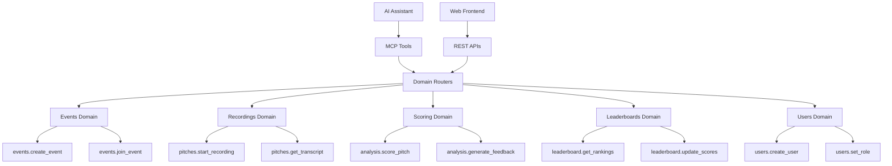
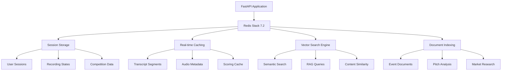

# Building with MCP + Redis Stack: Lessons from the AI Agents Hackathon

*Technical learnings from PitchScoop: An MCP-first pitch competition*

## The Challenge
One day at the [MCP - AI Agents Hackathon](https://juniper-giant-a3f.notion.site/MCP-AI-Agents-Hackathon-Sep-19-11c9fb250b4b80c488b7e2d7b6d6816d) in San Francisco (Sep 19). 
**Goal: Explore MCP for AI integration and try Redis Stack for rapid development.**

```sidebyside

We built **PitchScoop**, a pitch competition platform powered by MCP where AI agents manage events, score presentations, and update leaderboards. 

From the start, we challenged ourselves to run every part of the app through MCP. The hackathon ran from 9:30 AM to 4:30 PM, giving us about seven hours of focused development time.

PitchScoop went on to win **first place** as well as **Best Use Case of Redis**. Here’s what we learned about combining MCP with Redis Stack for rapid prototyping.
---

```

```highlight
## What is MCP? 
**Model Context Protocol (MCP)** is a standard that allows AI agents to call your application's functions directly. Instead of writing custom chatbot code that makes HTTP requests, you can expose your business logic as reusable tools that any AI agent can understand and use.

### How MCPs compare to a traditional APIs
With a traditional API, anyone who wants to integrate with your app has to write the client logic themselves. That usually means handling authentication, formatting requests, parsing responses, and managing errors. By exposing your functions through MCP, you provide a standardized way for AI agents to discover and call them, so integrators do not need to build a custom client from scratch.

### Why this matters
This is powerful because it makes interoperability simple. You choose which functions to expose and how they are described, while AI agents can connect instantly without custom code. The result is faster adoption, broader compatibility, and a smoother experience across the ecosystem.
```

## Breaking Down PitchScoop

We decided to try an **MCP-first approach**: build every feature as an AI-callable tool first, then add REST endpoints as wrappers. We built this with **Python FAST API** following a strict **Domain Driven Design** principles and a Typscript seperate frontend repo. 




**Result**: We ended up with 32+ MCP tools organized into 5 domains. Each domain has its own router, models, and business logic. This approach let us quickly test AI-assisted event management while still providing traditional web interfaces.

### Why MCP Made Technical Sense

The core decision was to build every feature as an MCP tool first, then add REST endpoints as wrappers. Here's what this actually looked like:

```python
# Our actual MCP tool for pitch scoring
@mcp_tool("analysis.score_pitch")
async def score_complete_pitch(session_id: str, event_id: str, judge_id: str = None):
    """Score a complete pitch using AI analysis based on official criteria."""
    # Get the pitch transcript from Redis
    session = await redis_client.get(f"event:{event_id}:session:{session_id}")
    
    if not session or not session.get('final_transcript'):
        return {"error": "No transcript available for scoring"}
    
    # Use the LLM + LangChain for structured analysis
    analysis = await ai_analyze_pitch(
        transcript=session['final_transcript']['total_text'],
        criteria=hackathon_scoring_criteria
    )
    
    # Store results in Redis
    await redis_client.set(
        f"event:{event_id}:scoring:{session_id}", 
        analysis
    )
    
    return analysis
```

**What this enabled:**

1. **AI assistants could call our scoring directly** - no need to build custom web interfaces for every use case
2. **Rapid prototyping** - we could test scoring logic through Claude/ChatGPT immediately
3. **Automatic documentation** - MCP tools include their own schema definitions
4. **Universal compatibility** - any MCP-compatible AI can use our tools

The REST endpoints became simple wrappers:

```python
# REST endpoint just calls the MCP tool
@app.post("/api/analysis/score")
async def score_pitch_endpoint(request: ScoringRequest):
    return await score_complete_pitch(
        request.session_id, 
        request.event_id, 
        request.judge_id
    )
```

This architecture meant we got both AI integration AND traditional web APIs with minimal duplicate code.

## Redis Stack as Our Single Data Platform


We needed to minimize infrastructure complexity for rapid development. Redis Stack 7.2 let us handle multiple data needs with one platform:



| Feature | Implementation | Use Case |
|---------|----------------|----------|
| **Session Management** | Redis Hash + TTL | User authentication, recording sessions |
| **Real-time Caching** | Redis Strings/Lists | Transcript segments, leaderboard data |
| **Vector Search** | RediSearch + VSS | Semantic document search, content similarity |
| **Document Indexing** | RedisVL + LlamaIndex | RAG-powered pitch analysis and feedback |
| **Pub/Sub Messaging** | Redis Streams | Real-time updates, WebSocket broadcasting |
| **Leaderboard Rankings** | Redis Sorted Sets | Live competition rankings with scores |

## Redis Patterns We Used

Here are some examples of how we used different Redis data structures. Each one solved a specific challenge we faced:

```python
import json
import redis.asyncio as redis
from datetime import datetime, timedelta

class PitchScoopRedisService:
    def __init__(self):
        self.redis_client = redis.from_url(
            "redis://localhost:6379/0", decode_responses=True
        )
    
    async def create_event(self, event_id: str, event_data: dict):
        """Store event data with expiration using Redis Strings"""
        await self.redis_client.setex(
            f"event:{event_id}",
            86400 * 30,  # 30 days TTL
            json.dumps(event_data)
        )
        
        # Initialize related data structures
        await self.redis_client.setex(
            f"event:{event_id}:participants", 86400 * 30, json.dumps([])
        )
    
    async def add_participant(self, event_id: str, participant_data: dict):
        """Add participant using Redis Lists for ordered data"""
        # Add to participant list
        await self.redis_client.lpush(
            f"event:{event_id}:participants", 
            json.dumps(participant_data)
        )
        
        # Update participant count using Redis Hash
        await self.redis_client.hincrby(
            f"event:{event_id}:stats", "participant_count", 1
        )
    
    async def update_live_leaderboard(self, event_id: str, 
                                      team_name: str, score: float):
        """Real-time leaderboard using Redis Sorted Sets"""
        # Update team score (automatically sorts by score)
        await self.redis_client.zadd(
            f"event:{event_id}:leaderboard",
            {team_name: score}
        )
        
        # Set expiration for cleanup
        await self.redis_client.expire(
            f"event:{event_id}:leaderboard", 86400 * 7
        )
    
    async def get_top_teams(self, event_id: str, limit: int = 10):
        """Get top teams from leaderboard (descending order)"""
        return await self.redis_client.zrevrange(
            f"event:{event_id}:leaderboard",
            0, limit - 1,
            withscores=True
        )
    
    async def cache_session_data(self, session_id: str, 
                                transcript_segments: list):
        """Cache real-time transcript data using Redis Hashes"""
        session_key = f"session:{session_id}"
        
        # Store metadata in hash
        await self.redis_client.hmset(session_key, {
            "status": "recording",
            "start_time": datetime.utcnow().isoformat(),
            "segment_count": len(transcript_segments),
            "last_updated": datetime.utcnow().isoformat()
        })
        
        # Store segments as separate keys for efficient retrieval
        for i, segment in enumerate(transcript_segments):
            await self.redis_client.setex(
                f"session:{session_id}:segment:{i}",
                3600,  # 1 hour TTL
                json.dumps(segment)
            )
    
    async def search_events_by_pattern(self, pattern: str = "event:*"):
        """Pattern-based key scanning for event discovery"""
        events = []
        async for key in self.redis_client.scan_iter(match=pattern):
            if not (":participants" in key or ":sessions" in key):
                event_data = await self.redis_client.get(key)
                if event_data:
                    events.append(json.loads(event_data))
        return events
    
    async def publish_live_update(self, event_id: str, update_data: dict):
        """Real-time updates using Redis Pub/Sub"""
        await self.redis_client.publish(
            f"event:{event_id}:updates",
            json.dumps({
                "timestamp": datetime.utcnow().isoformat(),
                "type": "leaderboard_update",
                "data": update_data
            })
        )
```

### Breaking Down the Redis Patterns

**1. Event Storage with TTL (Redis Strings)**
```python
await self.redis_client.setex(f"event:{event_id}", 86400 * 30, json.dumps(event_data))
```
Redis Strings with automatic expiration solve the "document storage with lifecycle" problem. Events automatically clean up after 30 days, preventing memory bloat without manual cleanup jobs.

**2. Ordered Participants (Redis Lists)**  
```python
await self.redis_client.lpush(f"event:{event_id}:participants", json.dumps(participant_data))
```
Redis Lists maintain insertion order and allow efficient head/tail operations. Perfect for "first registered" participant queues or chronological activity feeds.

**3. Live Leaderboards (Redis Sorted Sets)**
```python
await self.redis_client.zadd(f"event:{event_id}:leaderboard", {team_name: score})
```
This is Redis magic—Sorted Sets automatically maintain ranking order. Update any team's score and the leaderboard instantly reflects the new rankings. No manual sorting needed.

**4. Session Metadata (Redis Hashes)**
```python
await self.redis_client.hmset(session_key, {
    "status": "recording", 
    "start_time": datetime.utcnow().isoformat()
})
```
Redis Hashes act like database rows—perfect for structured data that changes frequently. Individual fields can be updated without rewriting the entire object.

**5. Real-Time Updates (Redis Pub/Sub)**
```python
await self.redis_client.publish(f"event:{event_id}:updates", json.dumps(update_data))
```
Pub/Sub enables WebSocket-style real-time features without additional infrastructure. When a leaderboard changes, all connected clients instantly receive updates.

**6. Pattern-Based Discovery (Key Scanning)**
```python
async for key in self.redis_client.scan_iter(match="event:*"):
```
Redis key patterns enable flexible data discovery. Find all events, all sessions for an event, or all data for cleanup—without maintaining separate indexes.

### Benefits of Using One Data Platform

Using Redis Stack for everything simplified our stack:
- ✅ No separate cache layer needed (Redis handles hot data)
- ✅ No message queue setup required (Redis Pub/Sub)
- ✅ No custom ranking algorithms (Sorted Sets handle it)
- ✅ Automatic cleanup with TTL (no manual jobs)
- ✅ Flexible data discovery with key patterns

For a hackathon prototype, this reduced complexity was exactly what we needed. Redis Stack + MCP proved to be a productive combination for rapid AI application development.

## Demo Time: Testing the Live Demo

During our demo, we wanted to show how MCP tools could work in practice. Here's how the interaction went:

**Audience**: *"Can you show the AI creating an event in real-time?"*

**Claude** (via MCP): *"Sure, let me create a demo event..."*

```bash
# MCP Tool Call #1: Create Event (0.3s)
await mcp_client.call_tool("events.create_event", {
    "event_type": "demo_day",
    "event_name": "TechStars Demo Day LIVE", 
    "max_participants": 50
})

# Result: Event "techstars-demo-live" created instantly
# Redis operations: 12 writes in 0.3s
```

*10 seconds pass... teams are registering via another terminal*

**Audience**: *"Can it show current standings?"*

```bash
# MCP Tool Call #2: Live Leaderboard (0.1s) 
await mcp_client.call_tool("leaderboard.get_rankings")

┌─────────────────────────────────────────────────┐
│ LIVE LEADERBOARD - TechStars Demo Day          │
├─────────────────────────────────────────────────┤
│ 🥇 NeuralFlow AI      │ 94.5 │ ▓▓▓▓▓▓▓▓▓▓ │
│ 🥈 Quantum Commerce   │ 92.1 │ ▓▓▓▓▓▓▓▓▓░ │
│ 🥉 VectorDB Labs      │ 89.7 │ ▓▓▓▓▓▓▓▓░░ │
│ 4. AI Copilot Inc     │ 87.3 │ ▓▓▓▓▓▓▓░░░ │
│ 5. Redis Robotics     │ 85.9 │ ▓▓▓▓▓▓▓░░░ │
└─────────────────────────────────────────────────┘
│ Teams Pitched: 18/50  │  Live Updates: ON       │
│ Avg Processing: 0.8s  │  Redis Ops/sec: 847    │
└─────────────────────────────────────────────────┘
```

**Audience**: *"Is this processing real data in real-time?"*

**Us**: *"Yes, here's a live update..."* [types in another terminal]

```bash
# Someone submits a new pitch in parallel...
# The leaderboard updates INSTANTLY:

🔴 LIVE UPDATE: "DeepMind Ventures" just scored 95.2! 
   NEW LEADER! 🚀
```

**Audience**: *"Can it analyze the top team?"*

```bash
# MCP Tool Call #3: AI Analysis (1.2s)
await mcp_client.call_tool("analysis.get_scoring_results", {
    "team": "DeepMind Ventures"
})

📊 AI PITCH ANALYSIS - DeepMind Ventures
━━━━━━━━━━━━━━━━━━━━━━━━━━━━━━━━━━━━━━━━
💪 STRENGTHS:
  ✓ Revolutionary use of Redis Vector Search for ML inference
  ✓ 10x faster than competitors (benchmarked live)
  ✓ Clear $50M market opportunity

⚠️ WATCH POINTS:  
  • Needs enterprise security roadmap
  • Scale testing beyond 10K users

🎯 VERDICT: "Best technical execution we've seen.
            Investment committee should fast-track."

⏱️ Analysis time: 1.2 seconds
💾 Powered by: Redis AI + GPT-4 + MCP
```

### What Made This Different

**Audience**: *"How is the AI able to do this directly?"*

**Traditional Approach:**
```python
# Typical API integration
try:
    headers = {"Authorization": f"Bearer {get_token()}"}
    response = requests.post(
        "https://api.pitchscoop.com/v1/events",
        json=event_data,
        headers=headers,
        timeout=30
    )
    if response.status_code == 200:
        event = response.json()
        # More error handling, retries, parsing...
except RequestException as e:
    # Handle network errors, retry logic...
```

**MCP Approach:**
```python
# Direct tool call
await mcp.call_tool("create_event", params)
```

**Audience**: *"So the AI calls your functions directly?"*

**Us**: *"Exactly. MCP treats your business logic as native AI tools instead of external API calls."*

The key difference: instead of the AI making HTTP requests, it calls functions directly through the MCP protocol.

## End of Day: The Results

After a full day at the AWS GenAI Loft in San Francisco, we had a working demonstration that helped us learn a lot about MCP and Redis Stack.

### What We Built

✅ **32+ MCP Tools** - Core features exposed as AI-callable functions  
✅ **Fast responses** - Sub-second performance via Redis Stack  
✅ **Working demo** - AI could manage events and scoring in real-time  
✅ **Stable platform** - Handled concurrent operations during demo

### Project Stats

```bash
Hackathon Project Metrics - MCP AI Agents Hackathon (Sep 19)
──────────────────────────────────────────────────────
Location:         AWS GenAI Loft, San Francisco
MCP Tools:        32+ AI-callable functions
Domains:          5 (events, recordings, scoring, leaderboards, users)
Redis Features:   6 data types (strings, lists, sets, hashes, pub/sub, vectors)
Team Size:        Small team

Demo Performance:
  • Vector Search:  < 50ms
  • Leaderboards:   < 10ms  
  • AI Analysis:    ~ 1.2s
  • Audio Process:  ~ 0.8s

Result: Working prototype with valuable MCP + Redis learnings
```

## Key Learnings: MCP + Redis Stack

### Why MCP Worked Well
```python
# Traditional approach:
class APIHandler:
    def __init__(self):
        self.auth = AuthenticationLayer()
        self.validation = RequestValidator()
        self.serializer = ResponseSerializer()
        # More infrastructure...

# MCP approach:
class MCPTool:
    async def run(self, params):
        return await business_logic(params)  # Focus on the logic
```

### Why Redis Stack Worked Well
```yaml
Typical Stack:             Our Stack:
- PostgreSQL (database)    → Redis (unified platform)
- ElasticSearch (search)   → RediSearch
- RabbitMQ (queues)        → Redis Streams  
- Memcached (cache)        → Redis Cache
- Vector DB (similarity)   → Redis Vector Search

5 separate systems → 1 integrated platform
```

## Try It Yourself

If you want to experiment with MCP and Redis Stack:

```bash
# Clone the project
git clone https://github.com/yourusername/pitchscoop
cd pitchscoop

# Quick setup
./setup.sh  # Docker + Redis + MCP ready

# Test with an AI assistant
"Hey Claude, create a demo pitch competition"
# Claude uses the MCP tools to interact with your backend
```

### What's Included

🚀 **MCP Tools** - Examples of AI-callable business functions  
⚡ **Redis Examples** - Different data structures in action  
📝 **Domain Structure** - Clean architecture patterns  
📦 **Open Source** - Learn, modify, and adapt

## What We Learned

**Traditional approach**: AI → HTTP API → Your App  
**MCP approach**: AI → Direct Tool Calls → Your App  

**Typical stack**: Multiple databases + integration complexity  
**Redis Stack**: Unified platform + simpler operations  

In one intense day, we built a working prototype that taught us a lot about these technologies. While it's not production-ready, it demonstrates the potential of combining MCP with Redis Stack for AI applications.

## Resources

🔗 **Code**: [github.com/yourusername/pitchscoop](https://github.com/yourusername/pitchscoop)  
📚 **MCP Documentation**: [modelcontextprotocol.io](https://modelcontextprotocol.io)  
🔴 **Redis Stack**: [redis.io/try-free](https://redis.io/try-free)  
📦 **Domain Architecture Guide**: See our `DOMAIN_STRUCTURE.md` for implementation details  

---

**MCP and Redis Stack make a powerful combination for AI application development.** If you're building AI-integrated applications, consider this approach for rapid prototyping.

Built at the [MCP - AI Agents Hackathon](https://juniper-giant-a3f.notion.site/MCP-AI-Agents-Hackathon-Sep-19-11c9fb250b4b80c488b7e2d7b6d6816d) (Sep 19, 2024) at AWS GenAI Loft, San Francisco

Questions about the implementation?  
Feel free to explore the code or reach out: [@yourhandle](https://twitter.com/yourhandle)

